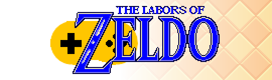

# The Labors of Zeldo

With **The Labor of Zeldo**, you can explore the never finished projects that Zeldo made using the Solarus Engine.
Games, retranscriptions of existing contents or simple tests, Zeldo is proposing you to play them in a totally playable and enjoyable version.
Have fun !

## Wave 1 - Tower of the Triforce

This 1st Wave of content is about **The Legend of Zelda - Tower of the Triforce**, a project made during 2017-2019 and never finished, due to a lack of inspiration and too many ideas and ambitions who overhelmed Zeldo.
The wave contents 7 playing areas with many collectibles to lengthen the playtime, and a lot of development notes, tips and anecdotes to reward the players who collect them all.

- **Release Date:** January 30th, 2024
- **Players:** 1
- **Length:** 2-4 hours
- **License:** Copyrighted assets + CC BY-SA 4.0 assets.
- **Languages:** French (English incoming)
